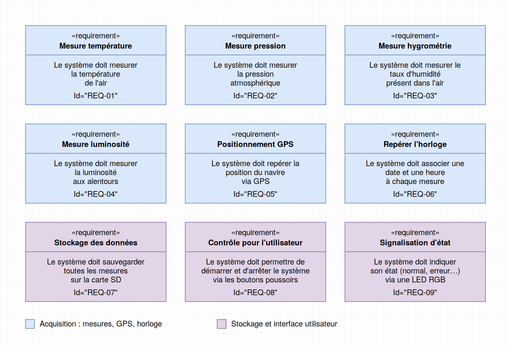
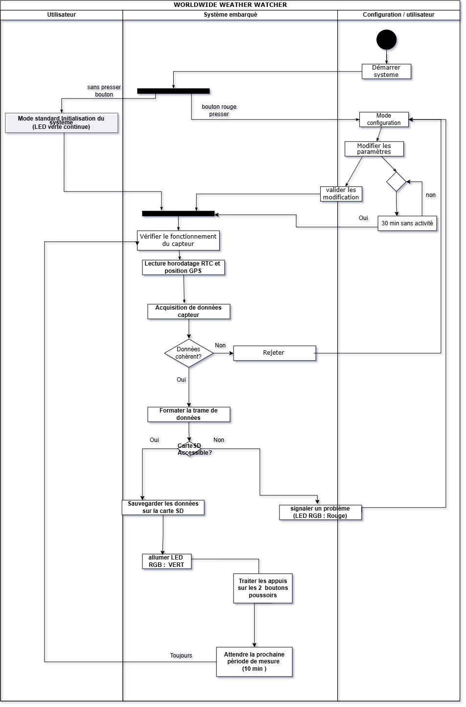
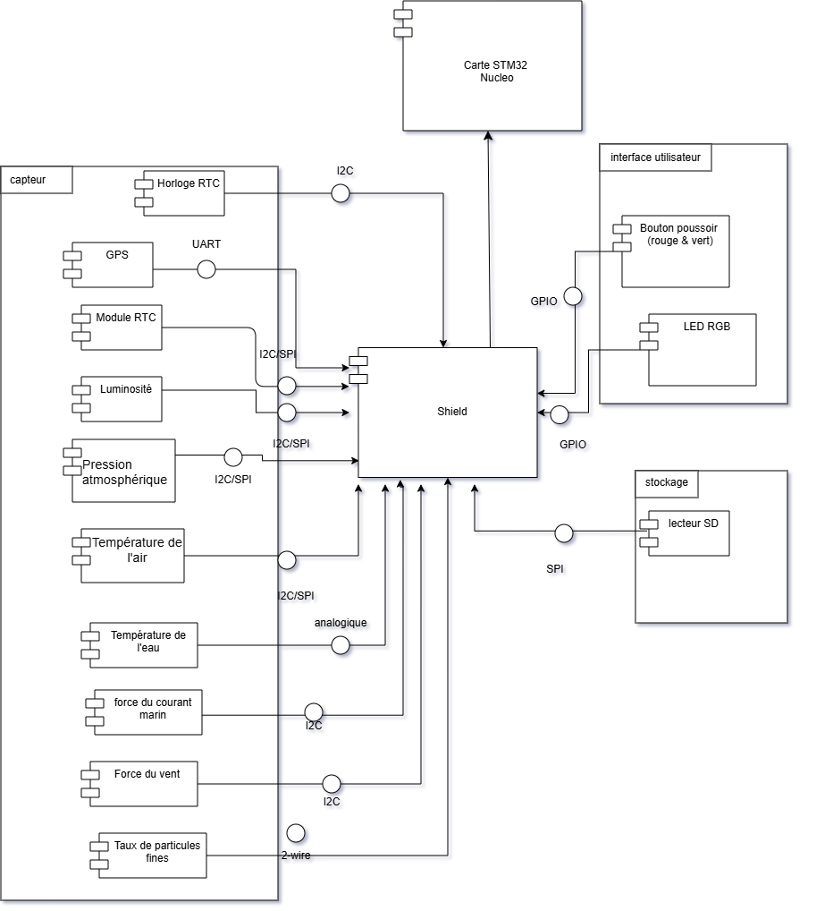

# LIVRABLE 1 — ANALYSE DU SYSTÈME

## 1. EXIGENCES

### DESCRIPTION
Ce diagramme d'exigences regroupe les neuf besoins fondamentaux de la station météo embarquée. Chaque exigence possède un identifiant unique (de `REQ-01` à `REQ-09`) pour faciliter le suivi tout au long du projet.

#### Nous avons les mesures environnementales
- **Mesure de la température (`REQ-01`)** : le système doit mesurer la température de l'air.
- **Mesure de la pression (`REQ-02`)** : le système doit mesurer la pression atmosphérique.
- **Mesure de l'hygrométrie (`REQ-03`)** : le système doit mesurer le taux d'humidité présent dans l'air.
- **Mesure de la luminosité (`REQ-04`)** : le système doit mesurer la luminosité aux alentours.

#### Ensuite nous avons la géolocalisation et l'horodatage de la station météo
- **Positionnement GPS (`REQ-05`)** : le système doit repérer la position du navire via GPS.
- **Repérer l'horloge (`REQ-06`)** : le système doit associer une date et une heure à chaque mesure.

#### Pour finir nous avons l'enregistrement et l'interfaçage
- **Stockage des données (`REQ-07`)** : le système doit sauvegarder toutes les mesures sur la carte SD.
- **Contrôle pour l'utilisateur (`REQ-08`)** : le système doit permettre à l'utilisateur de démarrer et d'arrêter le système via les boutons poussoirs. Les modes de fonctionnement accessibles avec ces boutons sont détaillés dans la section 2.
- **Signalisation d'état (`REQ-09`)** : le système doit indiquer son état (fonctionnement normal, erreur, etc.) à l'utilisateur via une LED RGB.

## 2. DIAGRAMME DE CAS D’UTILISATION

### Description

Ce diagramme représente la manière dont l'utilisateur à bord interagit avec la station météo. Nous l'avons construit en trouvant d'abord l'acteur principal, puis en regroupant l'ensemble des actions possibles autour des modes de fonctionnement, de la consultation des données et des réglages du système

### Résumé de notre démarche de modélisation
Pour concevoir ce diagramme, nous avons suivi trois étapes :
1. **Identification de l'acteur** : nous avons défini un unique acteur principal, le Membre de l'équipage, qui manipule la station directement sur le bateau
2. **Définition des fonctionnalités principales** : nous avons listé les actions indispensables comme la prise de mesure, la sauvegarde sur carte SD, la configuration et la surveillance
3. **Mise en place des règles matérielles** : nous avons associé les changements de modes aux boutons physiques.

### Description du diagramme

#### A. Gestion des modes de fonctionnement
Le système s'articule autour du **Mode Standard** et propose trois autres modes spécifiques accessibles avec les boutons poussoirs :
* **Démarrer mode standard** : le mode principal dans lequel la station effectue ses mesures et enregistrements normaux.
* **Basculer mode économique** : activé par un **appui de 5 secondes sur le bouton vert** pour réduire la fréquence des relevés et économiser l'énergie.
* **Basculer mode maintenance** : activé par un **appui de 5 secondes sur le bouton rouge** pour permettre les vérifications techniques sur le matériel.
* **Basculer mode configuration** : activé au démarrage en maintenant le **bouton rouge enfoncé**. Un **retour automatique en mode standard** s'effectue après **30 minutes sans activité** pour éviter de laisser la station bloquée.

#### B. Mesures, affichage et sauvegarde
* **Consulter les mesures** : permet de lire directement les valeurs météo courantes.
* **Acquérir les données des capteurs** : traitement interne qui lit les capteurs avant la consultation ou l'enregistrement.
* **Enregistrer les données sur la carte SD** : sauvegarde automatiquement les relevés pour un traitement ultérieur.
* **Consulter les données via l'interface série** : permet de lire le flux de données en direct en branchant un ordinateur.

#### C. Réglages et surveillance
* **Configurer les paramètres** : permet d'ajuster les options de la station.
* **Surveiller l'état du système** : permet au membre de l'équipage de vérifier le bon fonctionnement général de la station.
## 3. DIAGRAMME D’ACTIVITÉ

### Description

Ce diagramme représente le déroulement des opérations réalisées par la station météo, depuis le démarrage jusqu’à la réalisation périodique des mesures.

## 4. DIAGRAMME DE COMPOSANTS

### Description

Ce diagramme représente les différents composants matériels du **Worldwide Weather Watcher** ainsi que leurs interactions avec la carte **STM32 Nucleo**.

## 5. DIAGRAMME DE SÉQUENCE

### Description

Ce diagramme représente l’ordre chronologique des échanges entre les différents composants du système lors de l’acquisition et du traitement des données.

## SIGNALISATION 

## 6. Gestion et stockage des données

- Les mesures sont enregistrées sur une **carte SD**.
- L’ensemble des mesures est enregistré sur **une seule ligne horodatée**.
- L’intervalle entre deux mesures est de **10 minutes par défaut**, configurable avec `LOG_INTERVAL`.
- Si un capteur ne répond pas dans le délai `TIMEOUT` (**30 s par défaut**), la donnée correspondante est enregistrée comme `NA`.
- La taille maximale du fichier est définie par `FILE_MAX_SIZE` (**2 ko par défaut**).
- Les fichiers utilisent le format de nommage `200531_0.LOG` :
  - `20` : année
  - `05` : mois
  - `31` : jour
  - `0` : numéro de révision
- Le système écrit toujours dans le fichier de **révision 0**.
- Lorsque le fichier est plein, le système crée une **copie avec un numéro de révision adapté**, puis recommence à enregistrer les données dans le fichier de révision 0.
- En **mode maintenance**, les données ne sont plus écrites sur la carte SD mais peuvent être consultées directement depuis le **port série**.
- La carte SD peut alors être retirée et replacée en toute sécurité.
- En cas de carte SD pleine ou d’erreur d’accès/écriture, le système utilise le signal lumineux prévu.
  
## SOURCES
• Sujet du projet Worldwide Weather Watcher fourni dans la demande.
• Document « A2 – Projet Système embarqué – Modes de fonctionnement » fourni avec la demande.
• https://lucid.co/fr/diagramme/uml
