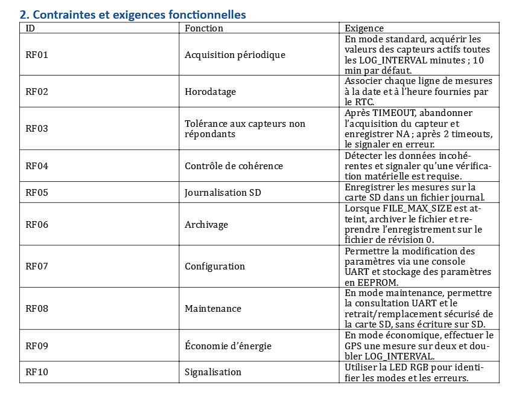

# LIVRABLE 1 — ANALYSE DU SYSTÈME

## 1. CONTRAINTES  ET EXIGENCES

## 2. DIAGRAMME DE CAS D’UTILISATION

### Description

Ce diagramme présente les principales fonctionnalités du Worldwide Weather Watcher et les interactions entre l’utilisateur et la station météo.

## 3. DIAGRAMME D’ACTIVITÉ

### Description

Ce diagramme représente le déroulement des opérations réalisées par la station météo, depuis le démarrage jusqu’à la réalisation périodique des mesures.

## 4. DIAGRAMME DE COMPOSANTS

### Description

Ce diagramme représente les différents composants matériels du **Worldwide Weather Watcher** ainsi que leurs interactions avec la carte **STM32 Nucleo**.

## 5. DIAGRAMME DE SÉQUENCE

### Description

Ce diagramme représente l’ordre chronologique des échanges entre les différents composants du système lors de l’acquisition et du traitement des données.

## 5. SIGNALISATION LED RGB

