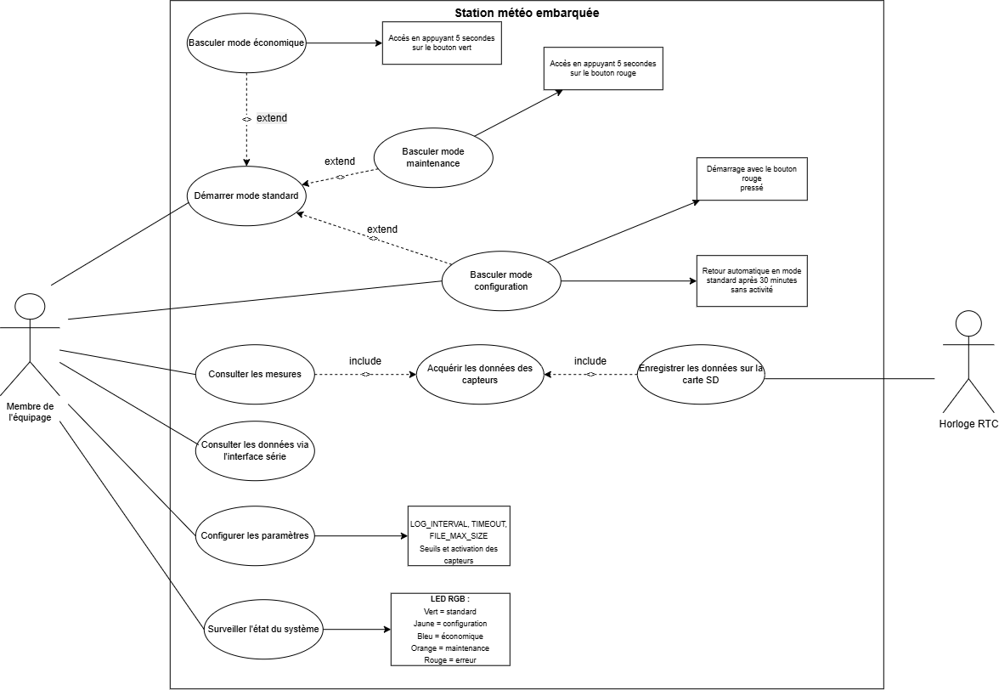
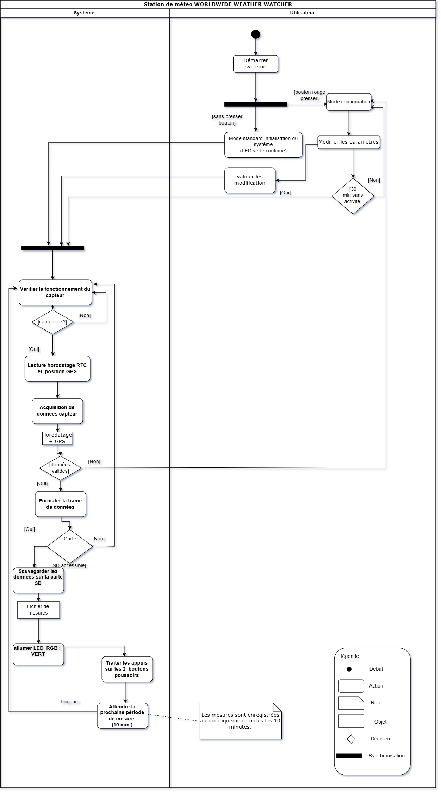
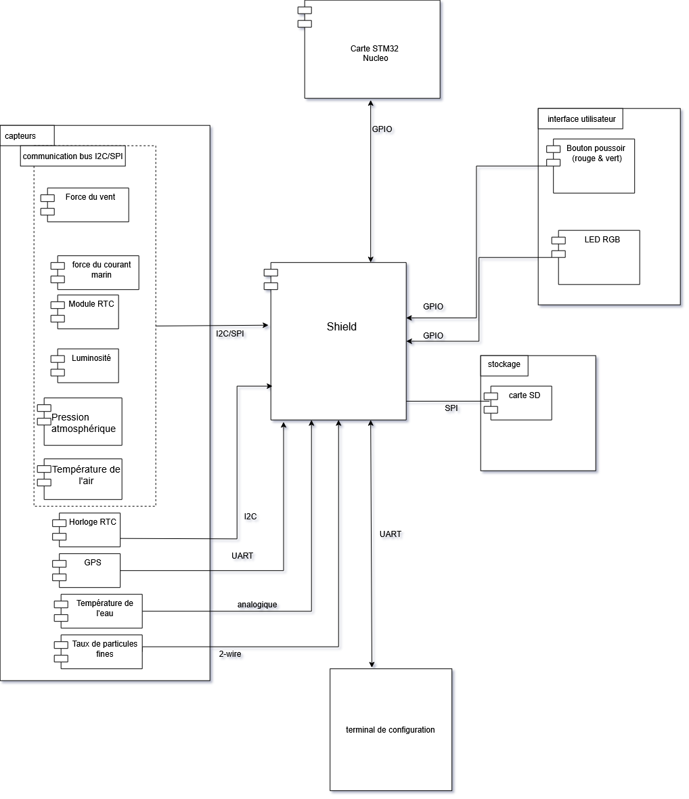
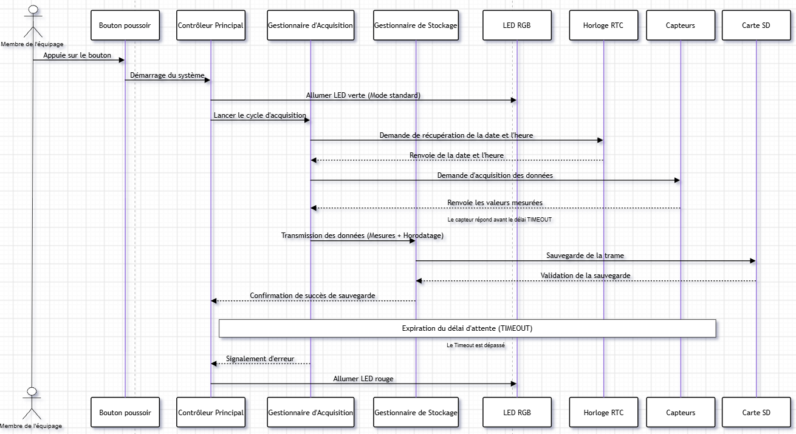
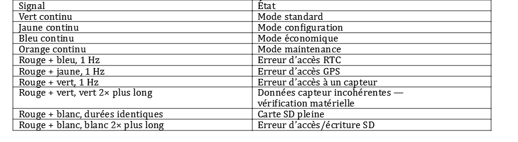

# LIVRABLE 1 — ANALYSE DU SYSTÈME

## ÉQUIPE

| Membre | Rôle | GitHub |
|---|---|---|
| Aymane TAHANI | Diagramme d'activité, exigences et rédaction du README | [@ayamithn](https://github.com/ayamithn) |
| Alexandre ALIAS | Diagramme de composants |[@QLEEEX](https://github.com/QLEEEX) |
| Pierre DE JOUVENCEL | Diagramme de cas d'utilisation |[@pierrejouvencel08-ship-it](https://github.com/pierrejouvencel08-ship-it) |
| Clément BOUYSSOU | Diagramme de séquence et rédaction du README | [@clement-bsso](https://github.com/clement-bsso) |
## 1. EXIGENCES

### DESCRIPTION 
Ce diagramme d'exigences regroupe les neuf besoins fondamentaux de la station météo embarquée. Chaque exigence possède un identifiant unique (de *REQ-01* à *REQ-09*) pour faciliter le suivi tout au long du projet.

#### Nous avons les mesures environnementales
- **Mesure de la température** : le système mesure la température de l’air.
- **Mesure de la pression** : le système mesure la pression atmosphérique.
- **Mesure de l’hygrométrie** : le système mesure l’hygrométrie.
- **Mesure de la luminosité** : le système mesure la luminosité et permet de déterminer son niveau.

#### Ensuite nous avons la géolocalisation et l'horodatage de la station météo
- **Acquisition GPS** : le système récupère les données du GPS.
- **Horodatage** : les mesures sont enregistrées avec la date et l’heure.

#### Pour finir nous avons l'enregistrement et l'interfaçage
- **Stockage des données** : les mesures sont enregistrées sur une carte SD.
- **Contrôle utilisateur** : l’utilisateur peut accéder aux différents modes de fonctionnement à l’aide des boutons poussoirs.
- [**Signalisation de l’état**](#SIGNALISATION) : une LED permet d’indiquer l’état du système et de signaler certaines erreurs.

## 2. DIAGRAMME DE CAS D’UTILISATION

### Description

Ce diagramme représente la manière dont l'utilisateur à bord interagit avec la station météo. Nous l'avons construit en trouvant d'abord l'acteur principal, puis en regroupant l'ensemble des actions possibles autour des modes de fonctionnement, de la consultation des données et des réglages du système

### Résumé de notre démarche de modélisation
Pour concevoir ce diagramme, nous avons suivi trois étapes :
1. **Identification de l'acteur** : nous avons défini un unique acteur principal, le membre de l'équipage, qui manipule la station en étant sur le bateau
2. **Définition des fonctionnalités principales** : nous avons listé les actions indispensables comme la prise de mesure, la sauvegarde sur carte SD, la configuration et la surveillance
3. **Mise en place des règles matérielles** : nous avons associé les changements de modes aux boutons poussoirs.

### Description du diagramme

#### Dans une première partie nous pouvons voir la gestion des modes de fonctionnement
Le système propose trois autres modes spécifiques accessibles (en plus du mode standard) avec les boutons poussoirs :
* **Démarrer mode standard** : le mode principal dans lequel la station effectue ses mesures et enregistrements
* **Basculer mode économique** : activé par un appui de 5 secondes sur le bouton vert pour réduire la fréquence des relevés et économiser de l'énergie
* **Basculer mode maintenance** : activé par un appui de 5 secondes sur le bouton rouge pour permettre les vérifications techniques sur le matériel
* **Basculer mode configuration** : activé au démarrage en maintenant le bouton rouge enfoncé. Il y a donc un retour automatique en mode standard qui s'effectue après 30 minutes sans activité.

#### Dans une deuxième partie nous pouvons voir les mesures, l'affichage et la sauvegarde des données
* **Consulter les mesures** : permet de lire directement les valeurs météo
* **Acquérir les données des capteurs** : traitement interne qui lit les capteurs avant la consultation ou l'enregistrement
* **Enregistrer les données sur la carte SD** : sauvegarde automatiquement les relevés
* **Consulter les données via l'interface série** : permet de lire le flux de données en direct

#### Pour finir nous avons les réglages et la surveillance
* **Configurer les paramètres** : permet d'ajuster les options de la station
* **Surveiller l'état du système** : permet au membre de l'équipage de vérifier le bon fonctionnement général de la station

## 3. DIAGRAMME D’ACTIVITÉ

Ce diagramme représente le déroulement des opérations réalisées par la station météo. Il permet de suivre pas à pas la logique du système, la gestion des erreurs et le passage entre le mode standard et le mode configuration

### Description

#### Démarrage et choix du mode
Au démarrage du système, deux voies sont possibles selon l'action de l'utilisateur :
* **Démarrage standard (sans presser de bouton)** : le système initialise les composants en mode standard et allume la **LED verte en continu**. Il passe ensuite directement à la boucle de mesure.
* **Démarrage en configuration (bouton rouge pressé)** : la station entre en mode configuration. L'utilisateur peut modifier les paramètres.
  * S'il **valide les modifications**, le système enregistre les changements et rejoint le cycle normal.
  * S'il n'y a **aucune activité pendant 30 minutes**, le système quitte automatiquement le mode configuration pour lancer la boucle de mesure.

#### Boucle d'acquisition et de traitement des données
Une fois la phase de démarrage terminée, la station entre dans sa boucle principale d'acquisition des données :
1. **Vérification du capteur** : le système contrôle que les capteurs répondent correctement
2. **Horodatage et géolocalisation** : la station lit l'heure sur le module RTC et la position courante via le GPS
3. **Acquisition des données** : les valeurs des capteurs (température, pression, humidité, ...) sont relevées
4. **Test de cohérence** :
   * **Si les données sont incohérentes** : la mesure est rejetée et le système renvoie vers le mode configuration ou le traitement d'erreur
   * **Si les données sont cohérentes** : la trame de données est préparée et formatée

#### C. Enregistrement sur carte SD et signalisation LED
5. **Test de la carte SD** :
   * **Si la carte SD est accessible** : les données y sont enregistrées, puis la LED s'allume en VERT pour indiquer que tout s'est bien passé.
   * **Si la carte SD n'est pas accessible** : le système signale un problème en allumant la LED en ROUGE.
6. **Interaction utilisateur** : le système vérifie si un appui sur l'un des deux boutons poussoirs a eu lieu pour traiter une éventuelle demande.
7. **Attente périodique** : la station se met en attente pendant 10 minutes avant de relancer automatiquement le cycle complet de mesure.

## 4. DIAGRAMME DE COMPOSANTS

Ce diagramme représente les différents composants matériels du système Worldwide Weather Watcher ainsi que les connexions physiques et les protocoles de communication avec la carte STM32 Nucleo

### Description
#### La carte maîtresse et Shield central
* **Carte STM32 Nucleo** : constitue le cœur de traitement microcontrôleur du système.
* **Shield** : carte d'extension intermédiaire centralisant la connectique et la distribution des signaux entre la carte Nucleo et l'ensemble des périphériques externes.

#### Sous-système Capteurs
Les capteurs communiquent avec le Shield via différents bus et protocoles normalisés :
* **Horloge RTC** : connectée via le bus **I2C** pour fournir la date et l'heure
* **GPS** : connecté via une liaison série **UART** pour récupérer les coordonnées géographiques
* **Module RTC** : connecté en **I2C/SPI** pour assurer un horodatage redondant
* **Luminosité** : connecté en **I2C/SPI** pour mesurer l'éclairement ambiant
* **Pression atmosphérique** : connecté en **I2C/SPI** pour suivre la pression barométrique
* **Température de l'air** : connecté en **I2C/SPI** pour la mesure thermique ambiante.
* **Température de l'eau** : connecté via une entrée **analogique**
* **Force du courant marin** : connecté via le bus **I2C**.
* **Force du vent** : connecté via le bus **I2C**.
* **Taux de particules fines** : connecté via le bus spécifique **2-wire**.

#### Sous-système Interface Utilisateur 
* **Bouton poussoir** : connecté aux broches **GPIO** pour capturer les actions manuelles (changement de modes, démarrage, ...).
* **LED RGB** : connectée aux broches **GPIO** pour signaler l'état opérationnel et les erreurs du système.

#### D. Sous-système Stockage
* **Lecteur SD** : connecté via le bus **SPI** à haute vitesse pour la lecture et l'écriture des fichiers de données sur la carte mémoire

## 5. DIAGRAMME DE SÉQUENCE

Ce diagramme représente l’ordre chronologique des échanges et des messages transmis entre les différents composants du système (acteur, contrôleur, capteurs, ...) lors de l’initialisation, de l’acquisition et du traitement des données

### Description

#### Initialisation et démarrage du système
1. **Action utilisateur** : l'Acteur appuie sur le bouton poussoir.
2. **Démarrage** : le Bouton poussoir envoie le signal de démarrage du système à la carte STM32.
3. **Signalisation d'état** : la carte STM32 ordonne à la LED RGB de s'allumer en vert pour confirmer l'entrée en mode standard opérationnel.

#### Acquisition des données environnementales
4. **Demande de mesure** : la carte STM32 transmet une requête d'acquisitions des données d'humidité aux Capteurs.
5. **Retour de mesure** : les Capteurs effectuent le relevé et effectuent un renvoie de la données d'humidité vers la carte STM32.

#### C. Horodatage de la mesure
6. **Requête temporelle** : dès réception de la mesure, la carte STM32 sollicite l'Horloge RTC pour la récupération de la date et heure de la données au moment du renvoie de la données d'humidité.
7. **Retour temporel** : l'Horloge RTC effectue le renvoie de la date et heure à la carte STM32.

#### D. Sauvegarde et confirmation
8. **Écriture sur SD** : la carte STM32 prépare le paquet complet et réalise un envoie des données (humidités, date et heure) dans la carte SD pour une sauvegarde.
9. **Confirmation** : la Carte SD finalise l'écriture mémoire et transmet un renvoie d'une validation de la sauvegarde reçu à la carte STM32

## SIGNALISATION 

## 6. Gestion et stockage des données
Les mesures sont enregistrées sur une carte SD.
- L’ensemble des mesures est enregistré sur une seule ligne horodatée.
- L’intervalle entre deux mesures est de 10 minutes par défaut, configurable avec *LOG_INTERVAL*.
- Si un capteur ne répond pas dans le délai *TIMEOUT* (30 s par défaut), la donnée correspondante est enregistrée comme *NA*.
- La taille maximale du fichier est définie par *FILE_MAX_SIZE* (2 ko par défaut).
- Les fichiers utilisent le format de nommage *200531_0.LOG* :
  - `20` : année
  - `05` : mois
  - `31` : jour
  - `0` : numéro de révision
- Le système écrit toujours dans le fichier de révision 0.
- Lorsque le fichier est plein, le système crée une copie avec un numéro de révision adapté, puis recommence à enregistrer les données dans le fichier de révision 0.
- En mode maintenance, les données ne sont plus écrites sur la carte SD mais peuvent être consultées directement depuis le port série.
- La carte SD peut alors être retirée et replacée en toute sécurité.
- En cas de carte SD pleine ou d’erreur d’accès/écriture, le système utilise le signal lumineux prévu.
  
## SOURCES
• Sujet du projet Worldwide Weather Watcher fourni dans la demande.
• Document « A2 – Projet Système embarqué – Modes de fonctionnement » fourni avec la demande.
• https://lucid.co/fr/diagramme/uml
• Utilisation d’un LLM pour la correction orthographique et la relecture du document.
