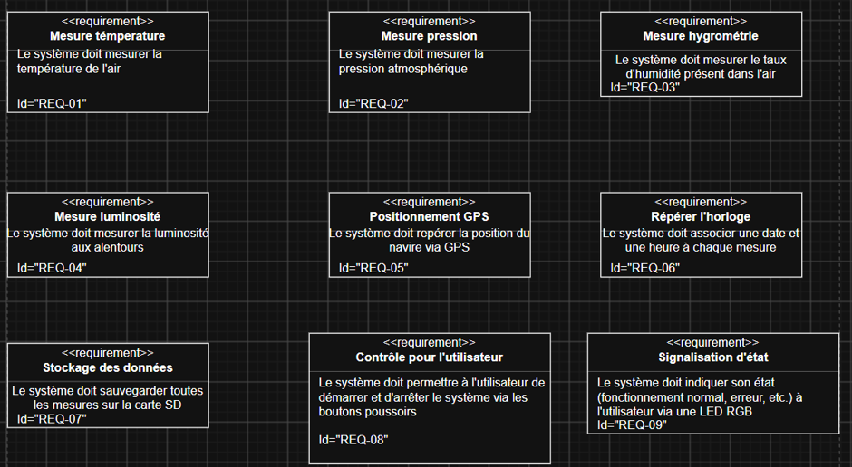
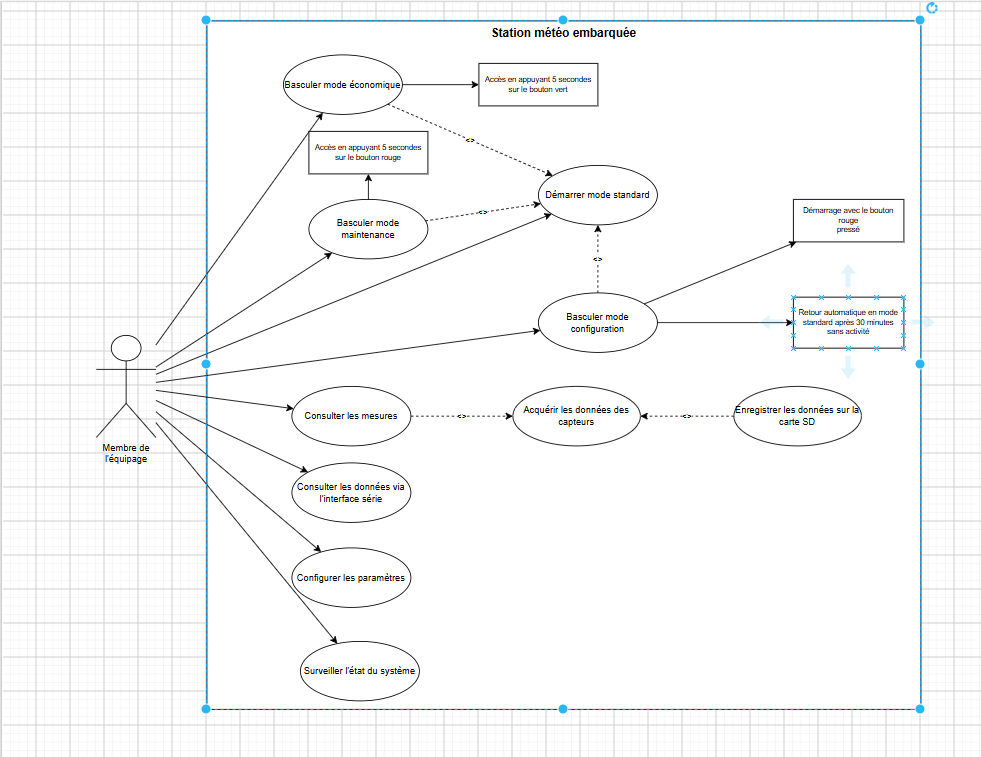
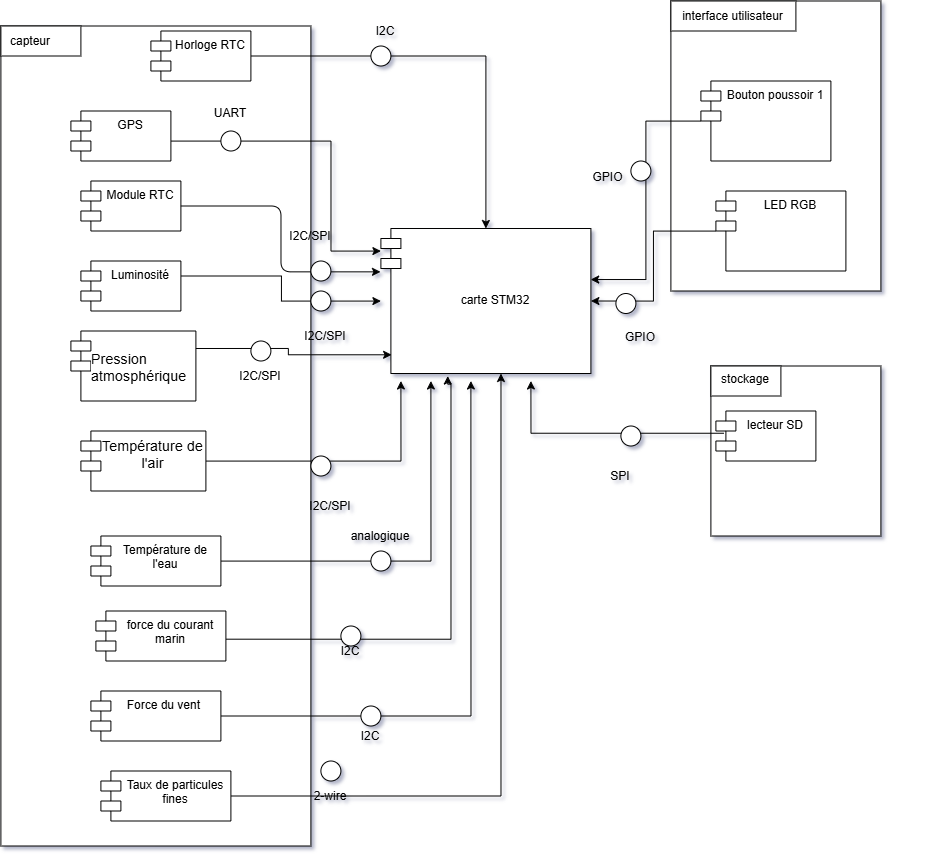
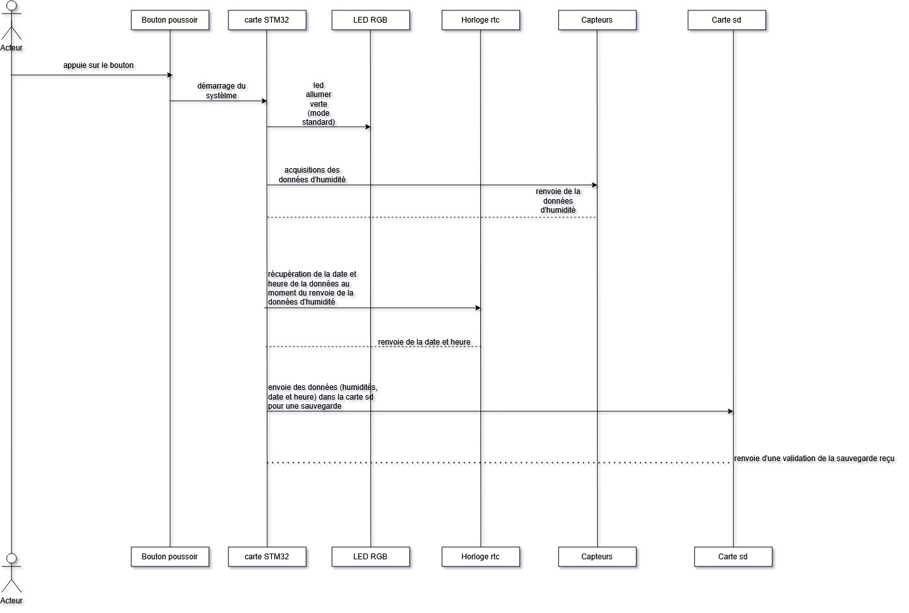
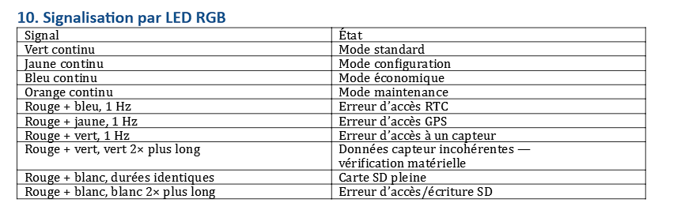

# LIVRABLE 1 — ANALYSE DU SYSTÈME

## 1. EXIGENCES

### DESCRIPTION 

- **Mesure de la température** : le système mesure la température de l’air.
- **Mesure de la pression** : le système mesure la pression atmosphérique.
- **Mesure de l’hygrométrie** : le système mesure l’hygrométrie.
- **Mesure de la luminosité** : le système mesure la luminosité et permet de déterminer son niveau.
- **Acquisition GPS** : le système récupère les données du GPS.
- **Horodatage** : les mesures sont enregistrées avec la date et l’heure.
- **Stockage des données** : les mesures sont enregistrées sur une carte SD.
- **Contrôle utilisateur** : l’utilisateur peut accéder aux différents modes de fonctionnement à l’aide des boutons poussoirs.
- **Signalisation de l’état** : une LED permet d’indiquer l’état du système et de signaler certaines erreurs.[ voire partie signalisation ](#6.-signalisation) 
## 2. DIAGRAMME DE CAS D’UTILISATION

### Description

Ce diagramme présente les principales fonctionnalités du Worldwide Weather Watcher et les interactions entre l’utilisateur et la station météo.

## 3. DIAGRAMME D’ACTIVITÉ

### Description

Ce diagramme représente le déroulement des opérations réalisées par la station météo, depuis le démarrage jusqu’à la réalisation périodique des mesures.

## 4. DIAGRAMME DE COMPOSANTS

### Description

Ce diagramme représente les différents composants matériels du **Worldwide Weather Watcher** ainsi que leurs interactions avec la carte **STM32 Nucleo**.

## 5. DIAGRAMME DE SÉQUENCE

### Description

Ce diagramme représente l’ordre chronologique des échanges entre les différents composants du système lors de l’acquisition et du traitement des données.

## 6. SIGNALISATION 

## 7. Gestion et stockage des données

- Les mesures sont enregistrées sur une **carte SD**.
- L’ensemble des mesures est enregistré sur **une seule ligne horodatée**.
- L’intervalle entre deux mesures est de **10 minutes par défaut**, configurable avec `LOG_INTERVAL`.
- Si un capteur ne répond pas dans le délai `TIMEOUT` (**30 s par défaut**), la donnée correspondante est enregistrée comme `NA`.
- La taille maximale du fichier est définie par `FILE_MAX_SIZE` (**2 ko par défaut**).
- Les fichiers utilisent le format de nommage `200531_0.LOG` :
  - `20` : année
  - `05` : mois
  - `31` : jour
  - `0` : numéro de révision
- Le système écrit toujours dans le fichier de **révision 0**.
- Lorsque le fichier est plein, le système crée une **copie avec un numéro de révision adapté**, puis recommence à enregistrer les données dans le fichier de révision 0.
- En **mode maintenance**, les données ne sont plus écrites sur la carte SD mais peuvent être consultées directement depuis le **port série**.
- La carte SD peut alors être retirée et replacée en toute sécurité.
- En cas de carte SD pleine ou d’erreur d’accès/écriture, le système utilise le signal lumineux prévu.
  
## SOURCES
• Sujet du projet Worldwide Weather Watcher fourni dans la demande.
• Document « A2 – Projet Système embarqué – Modes de fonctionnement » fourni avec la demande.
• https://lucid.co/fr/diagramme/uml
